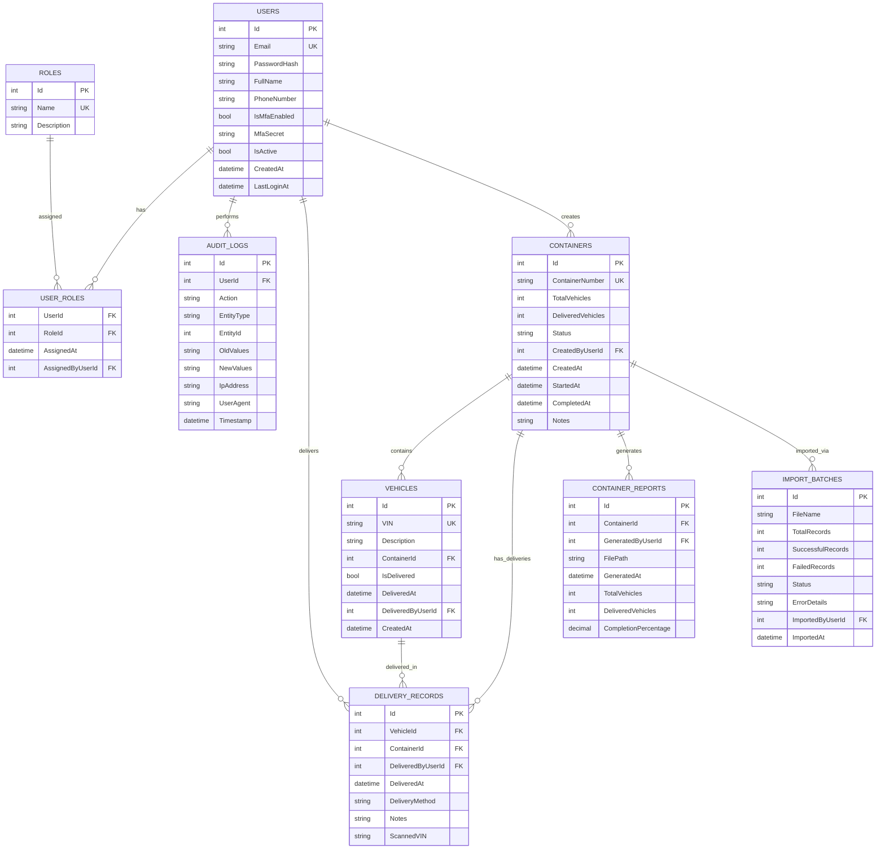

# Database Design - Container Vehicle Delivery Management System

## Entity Relationship Diagram (ERD)



## Table Definitions

### 1. Users Table
```sql
CREATE TABLE Users (
    Id INT IDENTITY(1,1) PRIMARY KEY,
    Email NVARCHAR(256) NOT NULL UNIQUE,
    PasswordHash NVARCHAR(512) NOT NULL,
    FullName NVARCHAR(200) NOT NULL,
    PhoneNumber NVARCHAR(20) NULL,
    IsMfaEnabled BIT NOT NULL DEFAULT 0,
    MfaSecret NVARCHAR(32) NULL, -- Base32 encoded TOTP secret
    MfaRecoveryCodes NVARCHAR(MAX) NULL, -- JSON array of recovery codes
    IsActive BIT NOT NULL DEFAULT 1,
    CreatedAt DATETIME2 NOT NULL DEFAULT SYSUTCDATETIME(),
    LastLoginAt DATETIME2 NULL,
    FailedLoginAttempts INT NOT NULL DEFAULT 0,
    LockedOutUntil DATETIME2 NULL
);

CREATE INDEX IX_Users_Email ON Users(Email);
CREATE INDEX IX_Users_IsActive ON Users(IsActive);
```

### 2. Roles Table
```sql
CREATE TABLE Roles (
    Id INT IDENTITY(1,1) PRIMARY KEY,
    Name NVARCHAR(50) NOT NULL UNIQUE,
    Description NVARCHAR(500) NULL
);

-- Seed data
INSERT INTO Roles (Name, Description) VALUES 
('Admin', 'Full system access including user management, audit logs, and container deletion'),
('DeliveryUser', 'Can view assigned containers, confirm deliveries, and generate reports');
```

### 3. UserRoles Table (Many-to-Many)
```sql
CREATE TABLE UserRoles (
    UserId INT NOT NULL,
    RoleId INT NOT NULL,
    AssignedAt DATETIME2 NOT NULL DEFAULT SYSUTCDATETIME(),
    AssignedByUserId INT NOT NULL,
    PRIMARY KEY (UserId, RoleId),
    FOREIGN KEY (UserId) REFERENCES Users(Id) ON DELETE CASCADE,
    FOREIGN KEY (RoleId) REFERENCES Roles(Id) ON DELETE CASCADE,
    FOREIGN KEY (AssignedByUserId) REFERENCES Users(Id)
);
```

### 4. Containers Table
```sql
CREATE TABLE Containers (
    Id INT IDENTITY(1,1) PRIMARY KEY,
    ContainerNumber NVARCHAR(50) NOT NULL UNIQUE,
    TotalVehicles INT NOT NULL DEFAULT 0,
    DeliveredVehicles INT NOT NULL DEFAULT 0,
    Status NVARCHAR(20) NOT NULL DEFAULT 'NotStarted', -- NotStarted, InProgress, FullyDelivered
    CreatedByUserId INT NOT NULL,
    CreatedAt DATETIME2 NOT NULL DEFAULT SYSUTCDATETIME(),
    StartedAt DATETIME2 NULL,
    CompletedAt DATETIME2 NULL,
    Notes NVARCHAR(MAX) NULL,
    FOREIGN KEY (CreatedByUserId) REFERENCES Users(Id)
);

CREATE INDEX IX_Containers_ContainerNumber ON Containers(ContainerNumber);
CREATE INDEX IX_Containers_Status ON Containers(Status);
CREATE INDEX IX_Containers_CreatedAt ON Containers(CreatedAt);
```

### 5. Vehicles Table
```sql
CREATE TABLE Vehicles (
    Id INT IDENTITY(1,1) PRIMARY KEY,
    VIN NVARCHAR(50) NOT NULL UNIQUE,
    Description NVARCHAR(500) NOT NULL,
    ContainerId INT NOT NULL,
    IsDelivered BIT NOT NULL DEFAULT 0,
    DeliveredAt DATETIME2 NULL,
    DeliveredByUserId INT NULL,
    CreatedAt DATETIME2 NOT NULL DEFAULT SYSUTCDATETIME(),
    FOREIGN KEY (ContainerId) REFERENCES Containers(Id) ON DELETE CASCADE,
    FOREIGN KEY (DeliveredByUserId) REFERENCES Users(Id)
);

CREATE INDEX IX_Vehicles_VIN ON Vehicles(VIN);
CREATE INDEX IX_Vehicles_ContainerId ON Vehicles(ContainerId);
CREATE INDEX IX_Vehicles_IsDelivered ON Vehicles(IsDelivered);
CREATE INDEX IX_Vehicles_Description ON Vehicles(Description);
```

### 6. DeliveryRecords Table
```sql
CREATE TABLE DeliveryRecords (
    Id INT IDENTITY(1,1) PRIMARY KEY,
    VehicleId INT NOT NULL,
    ContainerId INT NOT NULL,
    DeliveredByUserId INT NOT NULL,
    DeliveredAt DATETIME2 NOT NULL DEFAULT SYSUTCDATETIME(),
    DeliveryMethod NVARCHAR(20) NOT NULL, -- 'BarcodeScan', 'Manual'
    Notes NVARCHAR(MAX) NULL,
    ScannedVIN NVARCHAR(50) NULL, -- For barcode scan verification
    FOREIGN KEY (VehicleId) REFERENCES Vehicles(Id) ON DELETE CASCADE,
    FOREIGN KEY (ContainerId) REFERENCES Containers(Id) ON DELETE CASCADE,
    FOREIGN KEY (DeliveredByUserId) REFERENCES Users(Id)
);

CREATE INDEX IX_DeliveryRecords_VehicleId ON DeliveryRecords(VehicleId);
CREATE INDEX IX_DeliveryRecords_ContainerId ON DeliveryRecords(ContainerId);
CREATE INDEX IX_DeliveryRecords_DeliveredAt ON DeliveryRecords(DeliveredAt);
```

### 7. AuditLogs Table
```sql
CREATE TABLE AuditLogs (
    Id BIGINT IDENTITY(1,1) PRIMARY KEY,
    UserId INT NULL,
    Action NVARCHAR(100) NOT NULL, -- Create, Update, Delete, Login, Logout, Import, Export, Delivery
    EntityType NVARCHAR(100) NOT NULL, -- User, Container, Vehicle, Report, ImportBatch
    EntityId INT NULL,
    OldValues NVARCHAR(MAX) NULL, -- JSON
    NewValues NVARCHAR(MAX) NULL, -- JSON
    IpAddress NVARCHAR(45) NULL, -- IPv6 compatible
    UserAgent NVARCHAR(500) NULL,
    Timestamp DATETIME2 NOT NULL DEFAULT SYSUTCDATETIME(),
    FOREIGN KEY (UserId) REFERENCES Users(Id) ON DELETE SET NULL
);

CREATE INDEX IX_AuditLogs_UserId ON AuditLogs(UserId);
CREATE INDEX IX_AuditLogs_EntityType_EntityId ON AuditLogs(EntityType, EntityId);
CREATE INDEX IX_AuditLogs_Timestamp ON AuditLogs(Timestamp);
CREATE INDEX IX_AuditLogs_Action ON AuditLogs(Action);
```

### 8. ContainerReports Table
```sql
CREATE TABLE ContainerReports (
    Id INT IDENTITY(1,1) PRIMARY KEY,
    ContainerId INT NOT NULL,
    GeneratedByUserId INT NOT NULL,
    FilePath NVARCHAR(500) NOT NULL, -- Azure Blob Storage path
    FileName NVARCHAR(255) NOT NULL,
    GeneratedAt DATETIME2 NOT NULL DEFAULT SYSUTCDATETIME(),
    TotalVehicles INT NOT NULL,
    DeliveredVehicles INT NOT NULL,
    UndeliveredVehicles INT NOT NULL,
    CompletionPercentage DECIMAL(5,2) NOT NULL,
    FOREIGN KEY (ContainerId) REFERENCES Containers(Id) ON DELETE CASCADE,
    FOREIGN KEY (GeneratedByUserId) REFERENCES Users(Id)
);

CREATE INDEX IX_ContainerReports_ContainerId ON ContainerReports(ContainerId);
CREATE INDEX IX_ContainerReports_GeneratedAt ON ContainerReports(GeneratedAt);
```

### 9. ImportBatches Table
```sql
CREATE TABLE ImportBatches (
    Id INT IDENTITY(1,1) PRIMARY KEY,
    FileName NVARCHAR(255) NOT NULL,
    FilePath NVARCHAR(500) NOT NULL,
    TotalRecords INT NOT NULL DEFAULT 0,
    SuccessfulRecords INT NOT NULL DEFAULT 0,
    FailedRecords INT NOT NULL DEFAULT 0,
    Status NVARCHAR(20) NOT NULL DEFAULT 'Pending', -- Pending, Processing, Completed, Failed
    ErrorDetails NVARCHAR(MAX) NULL, -- JSON array of errors
    ImportedByUserId INT NOT NULL,
    ImportedAt DATETIME2 NOT NULL DEFAULT SYSUTCDATETIME(),
    CompletedAt DATETIME2 NULL,
    FOREIGN KEY (ImportedByUserId) REFERENCES Users(Id)
);

CREATE INDEX IX_ImportBatches_ImportedAt ON ImportBatches(ImportedAt);
CREATE INDEX IX_ImportBatches_Status ON ImportBatches(Status);
```

## Stored Procedures

### 1. Update Container Status (Trigger-based or Manual)
```sql
CREATE PROCEDURE UpdateContainerStatus
    @ContainerId INT
AS
BEGIN
    SET NOCOUNT ON;
    
    UPDATE Containers
    SET 
        DeliveredVehicles = (
            SELECT COUNT(*) FROM Vehicles WHERE ContainerId = @ContainerId AND IsDelivered = 1
        ),
        Status = CASE 
            WHEN (SELECT COUNT(*) FROM Vehicles WHERE ContainerId = @ContainerId AND IsDelivered = 1) = 0 
                THEN 'NotStarted'
            WHEN (SELECT COUNT(*) FROM Vehicles WHERE ContainerId = @ContainerId AND IsDelivered = 1) 
                 = (SELECT TotalVehicles FROM Containers WHERE Id = @ContainerId)
                THEN 'FullyDelivered'
            ELSE 'InProgress'
        END,
        CompletedAt = CASE 
            WHEN (SELECT COUNT(*) FROM Vehicles WHERE ContainerId = @ContainerId AND IsDelivered = 1) 
                 = (SELECT TotalVehicles FROM Containers WHERE Id = @ContainerId)
                THEN SYSUTCDATETIME()
            ELSE CompletedAt
        END
    WHERE Id = @ContainerId;
END;
```

### 2. Get Dashboard Statistics
```sql
CREATE PROCEDURE GetDashboardStatistics
AS
BEGIN
    SET NOCOUNT ON;
    
    SELECT 
        (SELECT COUNT(*) FROM Containers) AS TotalContainers,
        (SELECT COUNT(*) FROM Vehicles) AS TotalVehicles,
        (SELECT COUNT(*) FROM Containers WHERE Status = 'NotStarted') AS PendingContainers,
        (SELECT COUNT(*) FROM Containers WHERE Status = 'FullyDelivered') AS CompletedContainers,
        (SELECT COUNT(*) FROM Vehicles WHERE IsDelivered = 1) AS DeliveredVehicles,
        (SELECT COUNT(*) FROM Vehicles WHERE IsDelivered = 0) AS UndeliveredVehicles;
END;
```

## Full-Text Search Index
```sql
-- Enable full-text search on Vehicles table
CREATE FULLTEXT CATALOG VehicleCatalog AS DEFAULT;

CREATE FULLTEXT INDEX ON Vehicles
(
    VIN LANGUAGE 1033,
    Description LANGUAGE 1033
)
KEY INDEX PK_Vehicles
ON VehicleCatalog
WITH CHANGE_TRACKING AUTO;

-- Full-text search on Containers
CREATE FULLTEXT INDEX ON Containers
(
    ContainerNumber LANGUAGE 1033,
    Notes LANGUAGE 1033
)
KEY INDEX PK_Containers
ON VehicleCatalog
WITH CHANGE_TRACKING AUTO;
```

## Indexing Strategy

| Table | Index Name | Columns | Type | Purpose |
|-------|------------|---------|------|---------|
| Users | IX_Users_Email | Email | Non-clustered | Login lookup |
| Users | IX_Users_IsActive | IsActive | Non-clustered | Active user filtering |
| Containers | IX_Containers_ContainerNumber | ContainerNumber | Non-clustered | Unique lookup |
| Containers | IX_Containers_Status | Status | Non-clustered | Status filtering |
| Containers | IX_Containers_CreatedAt | CreatedAt | Non-clustered | Date range queries |
| Vehicles | IX_Vehicles_VIN | VIN | Non-clustered | Unique lookup |
| Vehicles | IX_Vehicles_ContainerId | ContainerId | Non-clustered | Container vehicles |
| Vehicles | IX_Vehicles_IsDelivered | IsDelivered | Non-clustered | Delivery status |
| Vehicles | IX_Vehicles_Description | Description | Non-clustered | Search |
| DeliveryRecords | IX_DeliveryRecords_VehicleId | VehicleId | Non-clustered | Vehicle history |
| DeliveryRecords | IX_DeliveryRecords_ContainerId | ContainerId | Non-clustered | Container deliveries |
| DeliveryRecords | IX_DeliveryRecords_DeliveredAt | DeliveredAt | Non-clustered | Date range reports |
| AuditLogs | IX_AuditLogs_UserId | UserId | Non-clustered | User activity |
| AuditLogs | IX_AuditLogs_EntityType_EntityId | EntityType, EntityId | Non-clustered | Entity history |
| AuditLogs | IX_AuditLogs_Timestamp | Timestamp | Non-clustered | Time-based queries |

## Data Retention Policy

| Data Type | Retention Period | Archive Strategy |
|-----------|-----------------|------------------|
| Audit Logs | 7 years | Monthly partition → Cold storage |
| Delivery Records | 7 years | With audit logs |
| Container Reports | 7 years | Blob storage with lifecycle policy |
| Import Batches | 3 years | Compressed archive |
| Completed Containers | Configurable (default 1 year) | Admin decision |

## Migration Strategy

1. **Initial Migration**: Create all tables with indexes
2. **Seed Data**: Roles, default admin user
3. **Full-Text Search**: Enable after data load
4. **Partitioning**: AuditLogs table by month (for large datasets)